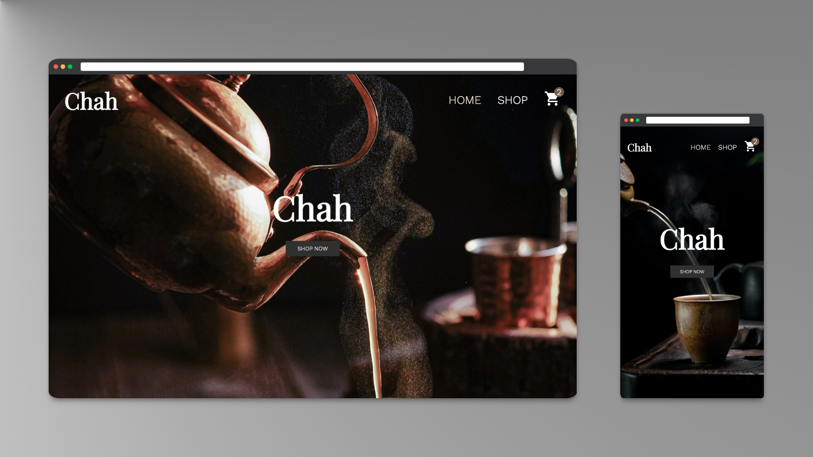
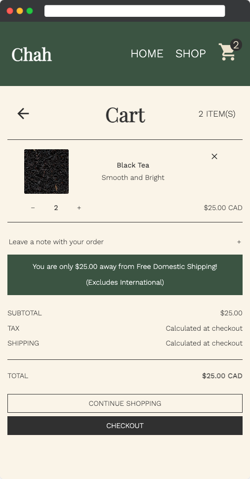
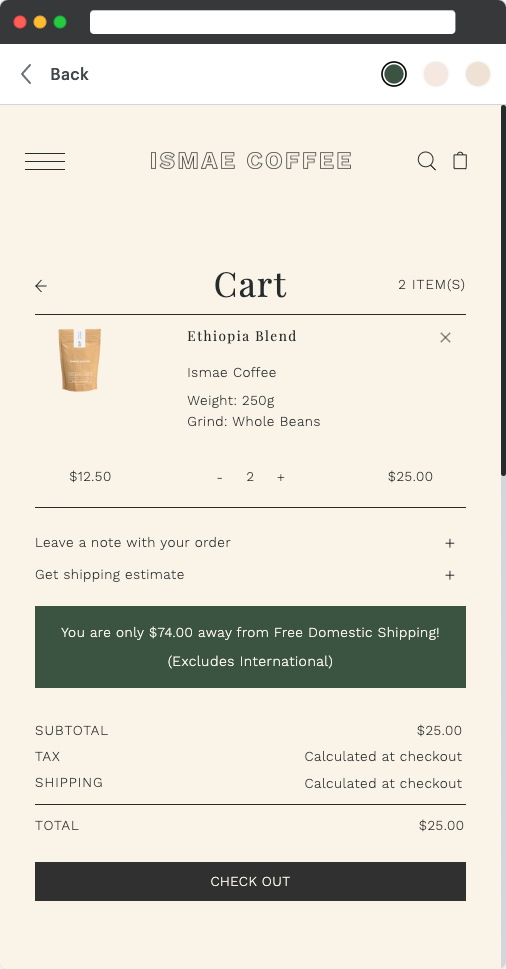

<h1 align="center">Chah - Fine Teas</h1>



<p align="center">
Mobile responsive e-commerce frontend
</p>

## Description
I made this single-page application for The Odin Project [Shopping Cart](https://www.theodinproject.com/lessons/nodejs-blog-api) assignment.

## Project Objectives
- Client-side routing with React Router
- Shopping cart component with item count visible from all routes
- Tests in React Testing Library


## Usage
Visit the [live site on GitHub Pages](https://kathyavini.github.io/shopping-cart/).

Or run locally with:
```bash
git clone https://github.com/kathyavini/shopping-cart.git
cd shopping-cart
npm install
npm run start
```

## Features
- Navigation and layout animations in CSS + Framer Motion
- Co-location of JSX and styles with Styled-Components
- Mobile-responsive

## Demo


## Technologies used
- [React](https://reactjs.org/)
- [React Router](https://reactrouter.com/en/main)
- [React Testing Library](https://testing-library.com/docs/react-testing-library/intro/)
- [Styled Components](https://styled-components.com/)


## Credits and Attributions
I modelled Chah on the Shopify Theme [Foodie by We Are Underground](https://themes.shopify.com/themes/foodie/styles/grind).

Especially for the cart component, I tried to replicate the design and the responsive behaviour pretty closely:

Chah (left) + Foodie: Grind Theme (right)




I also used the colours, fonts, buttons, and a few other inspirations throughout the site. It was a pleasure to work off of a professional design instead of trying to create my own, and it saved me quite a bit of time relative to my previous frontend projects :)

All credit and copyright belong to We Are Underground.

